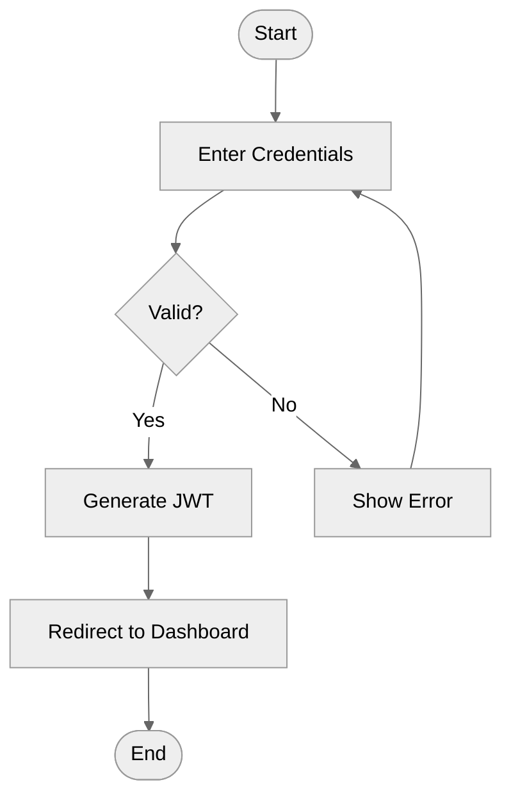

# Diagramming

Understandable first, beautiful second. Every diagram exists to communicate — if it fails to communicate, aesthetics are
irrelevant. When both are achievable, pursue both.

## References

- **Visual design principles** — [`${CLAUDE_SKILL_DIR}/references/design-principles.md`] Gestalt principles, grid
  system, spacing rules, color palette, typography, complexity budgets, anti-patterns, Tufte's data-ink principle
- **Excalidraw format** — [`${CLAUDE_SKILL_DIR}/references/excalidraw.md`] JSON schema, element types, styling
  properties, arrow binding, layout templates (linear, grid, radial, tiered, decision tree), diagram type conventions
- **Mermaid syntax** — [`${CLAUDE_SKILL_DIR}/references/mermaid.md`] Flowchart, sequence, class, state, ER diagram
  syntax, theming, per-node styling, subgraphs

## Format Selection

Choose the format that matches the delivery context:

<format-decision>

**Use Mermaid when:**

- The diagram lives in markdown (README, design doc, PR description, wiki)
- Auto-layout is acceptable — precise element positioning is not required
- The diagram type maps to a Mermaid-supported type
- Version-control readability matters (text diffs)
- Quick iteration speed matters more than visual refinement

**Use Excalidraw when:**

- Precise spatial layout is needed (architecture diagrams with specific grouping)
- The diagram needs freeform elements that don't fit a standard type
- Visual polish matters — color coding, consistent spacing, professional appearance
- The diagram will be used in presentations, external documentation, or design reviews
- The diagram needs to be manually editable after generation

</format-decision>

## Core Design Rules

These rules apply to every diagram regardless of format. They are non-negotiable.

- **Consistent shapes** — same concept type uses the same shape everywhere in the diagram. All services are rectangles.
  All databases are cylinders. All decisions are diamonds. Never vary shapes for the same concept.
- **Consistent flow direction** — pick one direction (top-to-bottom or left-to-right) and maintain it for all
  relationships of the same type within the diagram.
- **Semantic color** — color encodes meaning (tier, status, domain), never decoration. Maximum 2–3 accent colors per
  diagram. Use the semantic palette from the design-principles reference.
- **Label everything that isn't obvious** — every arrow in a complex diagram gets a label. Every color gets a legend
  entry. If a reader has to guess what something means, the diagram has failed.
- **Whitespace is structure** — group related elements tightly, separate groups with 2x the intra-group gap. When in
  doubt, add more space.
- **Complexity budget** — if a diagram exceeds 20 elements, split it. Create a high-level overview + detail diagrams. No
  exceptions.

## Spatial Reasoning Strategy

LLMs cannot reliably reason about spatial coordinates from scratch. Compensate with these strategies:

<spatial-strategy>

**For Excalidraw:**

1. **Start from a layout template.** Never invent coordinates from scratch. Pick the template that matches the diagram's
   topology (linear flow, grid, hub-and-spoke, tiered architecture, decision tree) from the Excalidraw reference.
2. **Use the grid.** All coordinates should be multiples of 50. Standard horizontal gap: 250px between elements.
   Standard vertical gap: 150px between rows.
3. **Calculate before placing.** Count elements first, determine grid dimensions, then assign coordinates
   systematically. Do not place elements one at a time hoping they'll line up.
4. **Work outward from anchor points.** Place the most important element first (center or top-left), then position
   everything else relative to it using consistent offsets.
5. **Verify mentally.** After computing all coordinates, check: do any elements overlap? Is the spacing consistent? Are
   arrows routing cleanly (no diagonal spaghetti)?

**For Mermaid:**

1. **Let the engine handle layout.** Do not fight the auto-layout — work with it.
2. **Use subgraphs for grouping.** The engine treats subgraph contents as a unit, producing cleaner layouts.
3. **Keep labels short.** Long labels break auto-layout. Use aliases for participants/nodes when labels exceed 3 words.
4. **Choose the right direction.** `LR` for processes, `TD` for hierarchies. Match direction to the conceptual flow.
5. **Never use lowercase `end` as a node ID** — it terminates blocks. See Mermaid reference for the full pitfall list.

</spatial-strategy>

## Diagram Type Guidance

### Flowcharts / Process Diagrams

- Start and end with terminal shapes (ellipse in Excalidraw, `([text])` in Mermaid)
- Decisions get diamond shapes with labeled outgoing edges ("Yes"/"No")
- Keep to a single flow direction — avoid loops that create visual spaghetti
- 3–10 steps is the sweet spot; 15 is the hard maximum per diagram

### Architecture / System Diagrams

- Group related services using frames (Excalidraw) or subgraphs (Mermaid)
- Use color to distinguish tiers: frontend (blue), backend (yellow), data (green), external (purple)
- Label connections with protocols and data formats (HTTP, gRPC, SQL, JSON)
- Include a legend when using 3+ colors or shape conventions
- Show system boundaries explicitly — what's inside vs. outside the system

### Sequence Diagrams

- Participants ordered left-to-right by first interaction
- Name participants with short aliases; use full names in the participant declaration
- Number messages when order matters
- Use activation boxes to show processing duration
- Keep to 3–6 participants and 10–15 messages per diagram

### Entity Relationship Diagrams

- Include primary keys (PK) and foreign keys (FK) in entity definitions
- Label relationships with both the verb and cardinality
- Use grid layout — entities at regular intervals, relationships as straight-line connections
- Group related entities spatially (user-domain entities together, product-domain together)

### Mind Maps

- Central topic at the center, main branches radiating outward
- 4–6 main branches maximum
- Use radial layout template (Excalidraw) — even angular distribution
- Color-code branches by theme
- Sub-topics attach to their branch, not to the center

## Excalidraw Defaults

When generating Excalidraw JSON, use these defaults unless the context demands otherwise:

- `roughness: 0` — clean lines for professional output
- `fillStyle: "solid"` — solid fills, not hachure
- `strokeWidth: 2` — normal weight
- `fontFamily: 5` — Excalifont (current Excalidraw default)
- `fontSize: 20` — box labels; 28 for titles; 16 for descriptions
- `roundness: { "type": 3 }` — rounded rectangle corners
- Background: `#ffffff`

## Output Conventions

After generating a diagram:

1. **Save with a descriptive filename** — `user-auth-flow.excalidraw` or include Mermaid inline in the document
2. **State what the diagram shows** — one sentence summarizing scope and element count
3. **Provide viewing instructions** for Excalidraw files:
   - Drag-and-drop at excalidraw.com
   - Open with VS Code Excalidraw extension
   - Open with Obsidian Excalidraw plugin
4. **Offer to split** if the diagram is complex — "This has 18 elements. Want me to split into overview + detail?"

## Worked Example

<examples>

**Request:** "Create a diagram showing the user authentication flow"

**Format decision:** This is a process flow for a design doc → Mermaid (markdown-embedded, auto-layout sufficient).

**Output:**

Created: authentication flow diagram (7 nodes, 7 edges). Embedded inline in the design document.

---

**Request:** "Create an architecture diagram of our API gateway setup"

**Format decision:** Architecture diagram needing spatial grouping and color-coded tiers → Excalidraw.

**Agent approach:**

1. Count components: API Gateway, Auth Service, User Service, Product Service, PostgreSQL, Redis — 6 elements
2. Select template: Tiered Architecture (3 tiers: gateway, services, data)
3. Assign coordinates from template, semantic colors per tier
4. Generate `.excalidraw` JSON with bound arrows and labels
5. Save as `api-gateway-architecture.excalidraw`

</examples>

## Integration with Blueprint Skills

Diagrams are a design-phase artifact. They compose naturally with the blueprint pipeline:

- During `design-documents` — create diagrams to illustrate the problem space, compare solution options visually
- During `technical-design` — create architecture diagrams showing component relationships, data flow, deployment
  topology
- Standalone — create diagrams on request outside the pipeline context

## Quality Gate

Before delivering any diagram, verify:

- [ ] All elements have unique IDs (Excalidraw)
- [ ] No elements overlap — coordinates verified against element sizes
- [ ] Text is readable — minimum 14px, labels fit within their containers
- [ ] Colors follow semantic palette — no decorative rainbow
- [ ] Arrows are labeled when the relationship isn't obvious
- [ ] Flow direction is consistent throughout
- [ ] Element count is within budget (≤20, or split proposed)
- [ ] Legend present if using color/shape coding with 3+ categories
