# Mermaid Reference

Mermaid is a text-based diagramming language that renders natively in GitHub, GitLab, Obsidian, and many markdown
renderers. Layout is automatic — the agent declares relationships and the engine handles positioning. This makes Mermaid
ideal when spatial precision is less important than portability and speed.

## When to Use Mermaid

- Diagram lives in markdown (README, design doc, PR description)
- Auto-layout is acceptable — no need for pixel-precise positioning
- Diagram type maps to a Mermaid-supported type (see catalog below)
- Diagram needs to be version-controlled as readable text diffs

## Agentic Pitfalls

Common mistakes LLMs make when generating Mermaid. Internalize these before producing any diagram.

<agentic-pitfalls>

**Reserved word `end`:** The word `end` in lowercase terminates blocks (subgraphs, loops, alt). Never use it as a node
ID or label. Wrap in quotes (`"End"`) or capitalize (`END`).

**`o` and `x` prefix collision:** A node ID starting with `o` or `x` immediately after a link is parsed as a circle or
cross edge. `A---oB` becomes a circle edge, not a link to node `oB`. Fix: add a space (`A--- oB`) or capitalize
(`A---OB`).

**Unquoted special characters:** Labels containing parentheses, brackets, commas, or colons must be wrapped in quotes.
`A[Process (main)]` breaks — use `A["Process (main)"]`.

**Under-generation of logic:** LLMs tend to simplify processes by omitting decision gateways and parallel branches,
producing single-sequence flows. Explicitly model branching when the source material describes decisions or parallel
work.

**Node count limits:** Flowcharts degrade above ~15 nodes. For larger systems, split into multiple diagrams with prose
connecting them, or use subgraphs to create visual clusters.

**Theme color names:** The theming engine only recognizes hex colors. `fill:red` is silently ignored — use
`fill:#ff0000`.

**Version-dependent syntax:** Platforms lag behind the latest Mermaid release. Obsidian's built-in renderer uses ~v11.4,
GitHub lags moderately. Avoid bleeding-edge syntax (beta diagram types) if portability matters.

**Missing diagram declaration:** Every Mermaid block must start with a diagram type keyword (`flowchart TD`,
`sequenceDiagram`, etc.). Omitting it causes a parse failure.

</agentic-pitfalls>

## Flowcharts

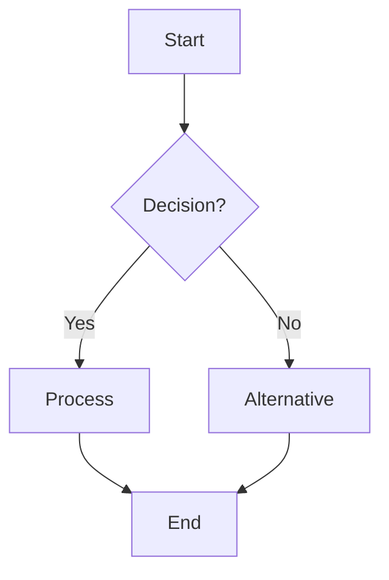

### Direction

- `TD` / `TB` — top-down (default)
- `LR` — left-right
- `BT` — bottom-top
- `RL` — right-left

### Node Shapes

- `[text]` — rectangle
- `(text)` — rounded rectangle
- `{text}` — diamond (decision)
- `([text])` — stadium/pill
- `[[text]]` — subroutine
- `[(text)]` — cylinder (database)
- `((text))` — circle
- `>text]` — asymmetric (flag)
- `{{text}}` — hexagon
- `[/text/]` — parallelogram
- `[\text\]` — parallelogram (alt)
- `[/text\]` — trapezoid
- `[\text/]` — trapezoid (alt)
- `(((text)))` — double circle

### Edge Syntax

- `-->` — solid arrow
- `---` — solid line (no arrow)
- `-.->` — dotted arrow
- `==>` — thick arrow
- `-->|label|` — labeled edge
- `--label-->` — alternative label syntax
- `--o` — circle end
- `--x` — cross end
- `<-->` — bidirectional arrow
- `o--o` — bidirectional circle
- `x--x` — bidirectional cross

Edge length increases with extra dashes: `-->` (default), `--->` (longer), `---->` (even longer).

### Subgraphs

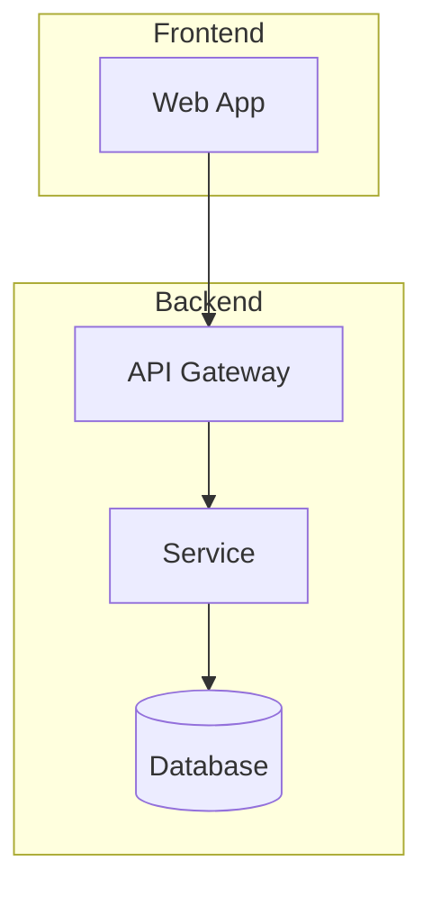

Subgraphs can have their own direction override: `subgraph id ["Title"] direction LR`. Subgraphs can link to other
subgraphs, nodes to subgraphs, and subgraphs to nodes.

### Renderer

The default layout engine is Dagre. For large or complex diagrams with overlapping nodes, use the ELK renderer:

```
%%{init: {"flowchart": {"defaultRenderer": "elk"}} }%%
```

ELK is not bundled by default — it requires integration-level setup.

## Sequence Diagrams

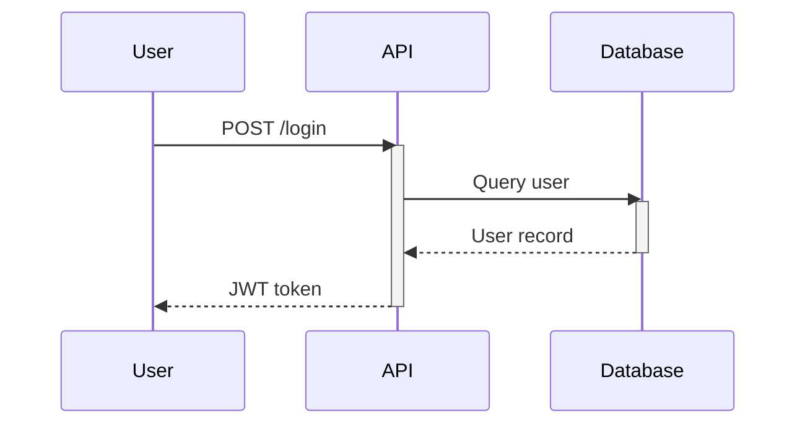

### Message Types

- `->>` — solid arrow (synchronous)
- `-->>` — dashed arrow (response/async)
- `-x` — solid with X (lost message)
- `-)` — open arrowhead (async)

### Features

- `activate`/`deactivate` — activation boxes on lifelines
- `Note over A,B: text` — notes spanning participants
- `alt`/`else`/`end` — conditional blocks
- `loop`/`end` — loop blocks
- `par`/`and`/`end` — parallel execution
- `critical`/`option`/`end` — critical regions
- `break`/`end` — break out of a flow
- `rect rgb(r,g,b)` — background highlight
- `autonumber` — sequential message numbering
- `actor` keyword — stick figure instead of box (e.g., `actor U as User`)
- `create participant` / `destroy participant` — dynamic creation/destruction (v10.3.0+)

### Participant Grouping

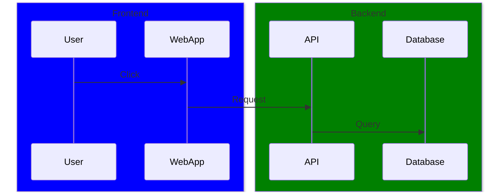

## Class Diagrams

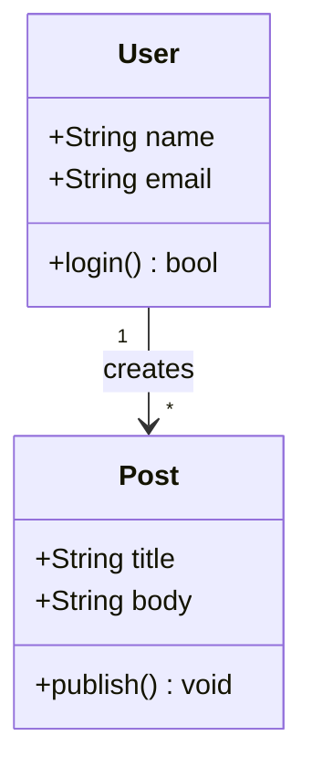

### Relationships

- `<|--` — inheritance (solid + triangle)
- `*--` — composition (solid + filled diamond)
- `o--` — aggregation (solid + empty diamond)
- `-->` — association (solid arrow)
- `..>` — dependency (dashed arrow)
- `<|..` — realization (dashed + triangle)

### Visibility

- `+` — public
- `-` — private
- `#` — protected
- `~` — package/internal

### Additional Features

- Generics: `ClassName~T~`, `List~String~`
- Static members: suffix with `$` (e.g., `getInstance()$`)
- Abstract members: suffix with `*` (e.g., `draw()*`)
- Annotations: `<<Interface>>`, `<<Enumeration>>`, `<<Service>>`
- Direction: `direction LR` or `direction TB`
- Cardinality: `"1"`, `"0..1"`, `"*"`, `"0..*"`, `"1..*"`

## State Diagrams

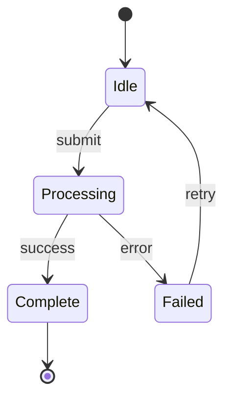

### Features

- `[*]` — start/end pseudo-state
- `state "Description" as s1` — named states
- `state fork_state <<fork>>` — fork/join
- Nested states via `state Parent { ... }`
- `classDef` styling supported (cannot be applied inside composite states)
- `:::` operator to apply styles to states

## Entity Relationship Diagrams

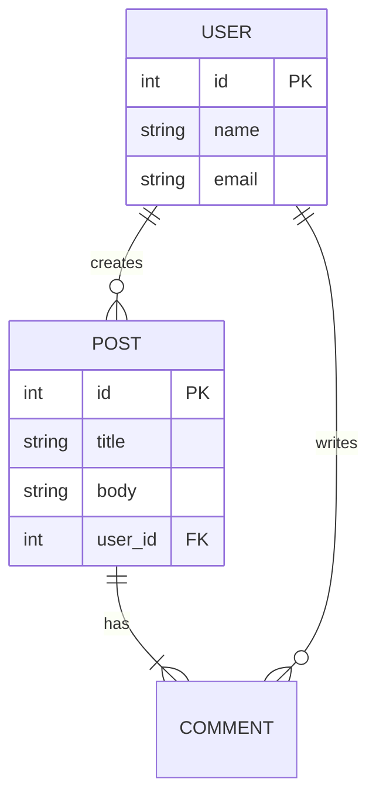

### Cardinality

- `||` — exactly one
- `o|` — zero or one
- `}|` — one or more
- `o{` — zero or more

Read left-to-right: `USER ||--o{ POST` = "one user has zero or more posts"

## Gantt Charts

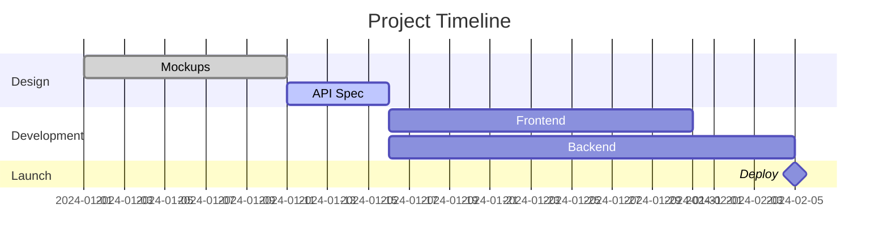

### Task Syntax

`Task Name : <status>, <id>, <start>, <duration_or_end>`

- **Status tags** (optional, must come first): `done`, `active`, `crit`, `milestone` — combinable (e.g., `crit, active`)
- **ID** (optional): used for `after` dependencies
- **Start**: absolute date or `after taskId1 taskId2`
- **Duration**: `5d`, `3w`, `12h`, `30m`
- **Milestones**: tasks with `0d` duration

### Configuration

- `dateFormat YYYY-MM-DD` — input date format
- `axisFormat %Y-%m-%d` — display format (d3-time-format)
- `todayMarker off` — disable today line
- `excludes weekends` — skip weekends
- `displayMode compact` — compact layout

## Mindmaps

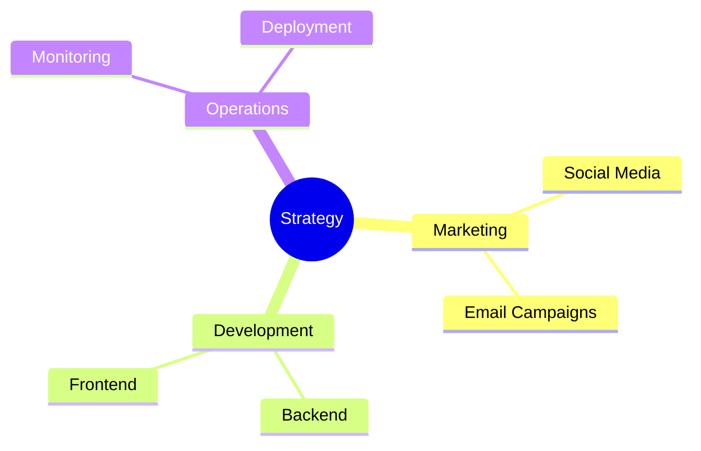

Hierarchy is defined by **indentation** (use consistent spaces — 2 or 4). The root node is the first unindented line.

### Node Shapes

- Default — rounded rectangle
- `[Square]` — square
- `(Rounded)` — rounded square
- `((Circle))` — circle
- `))Bang((` — bang shape
- `)Cloud(` — cloud
- `{{Hexagon}}` — hexagon

### Icons

`::icon(fa fa-book)` or `::icon(mdi mdi-brain)` — requires site-level icon font integration. Not portable across all
platforms.

## Pie Charts

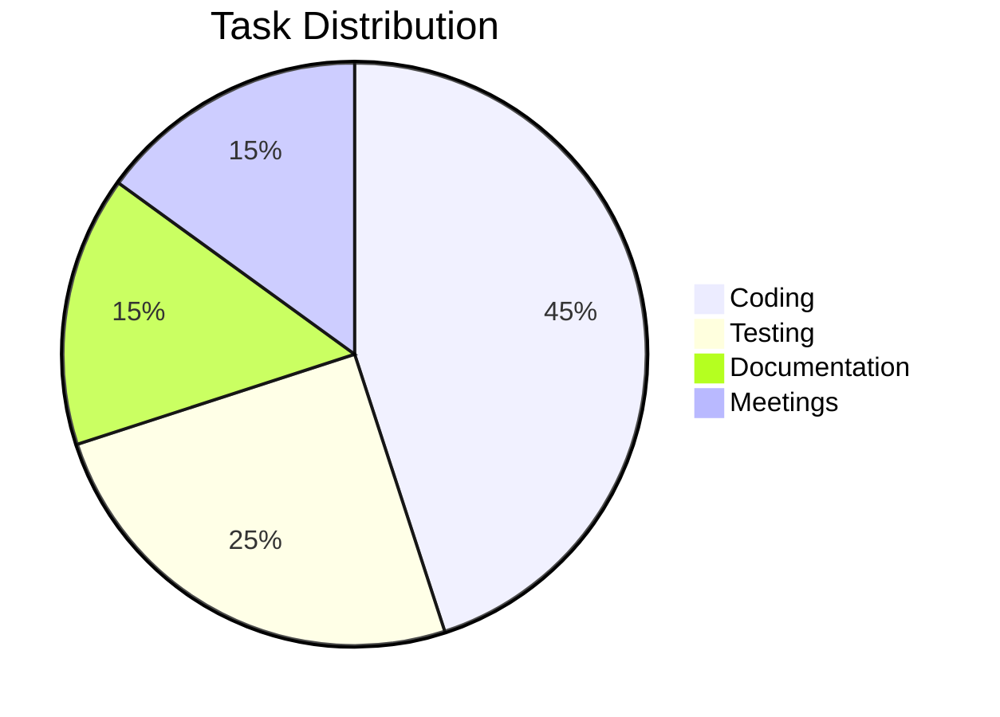

Add `showData` after `pie` to display actual values alongside percentages.

## Timeline

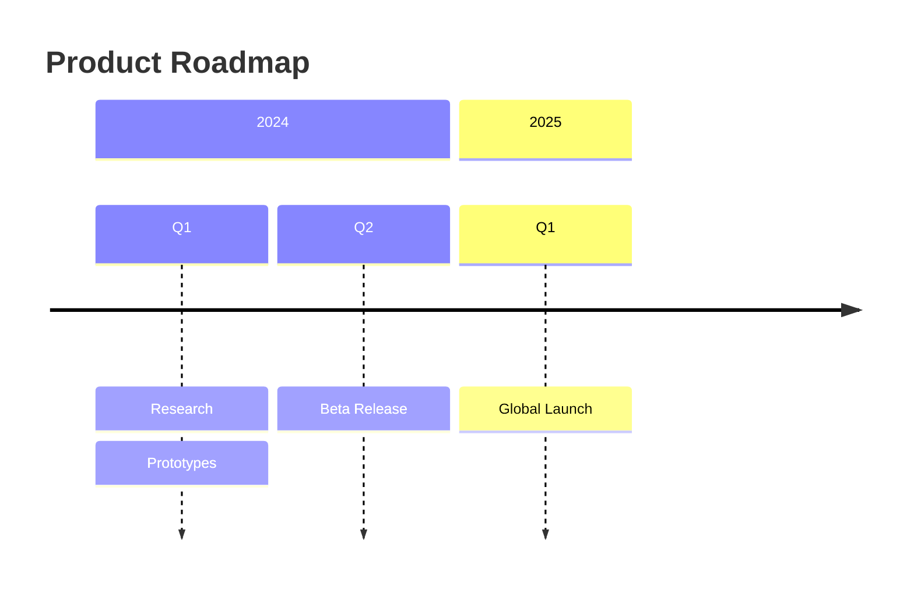

Events grouped by `section`. Multiple events per time block separated by `:`.

## Git Graph

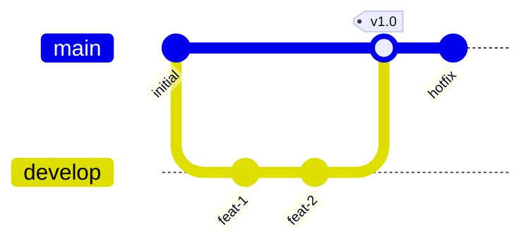

### Commands

- `commit` — new commit (optional: `id:`, `msg:`, `tag:`, `type: HIGHLIGHT`)
- `branch <name>` — create branch (optional: `order: <n>`)
- `checkout <name>` — switch branch
- `merge <name>` — merge into current (optional: `id:`, `tag:`, `type: REVERSE`)
- `cherry-pick id: "<commit-id>"` — cherry-pick a specific commit

## Quadrant Chart

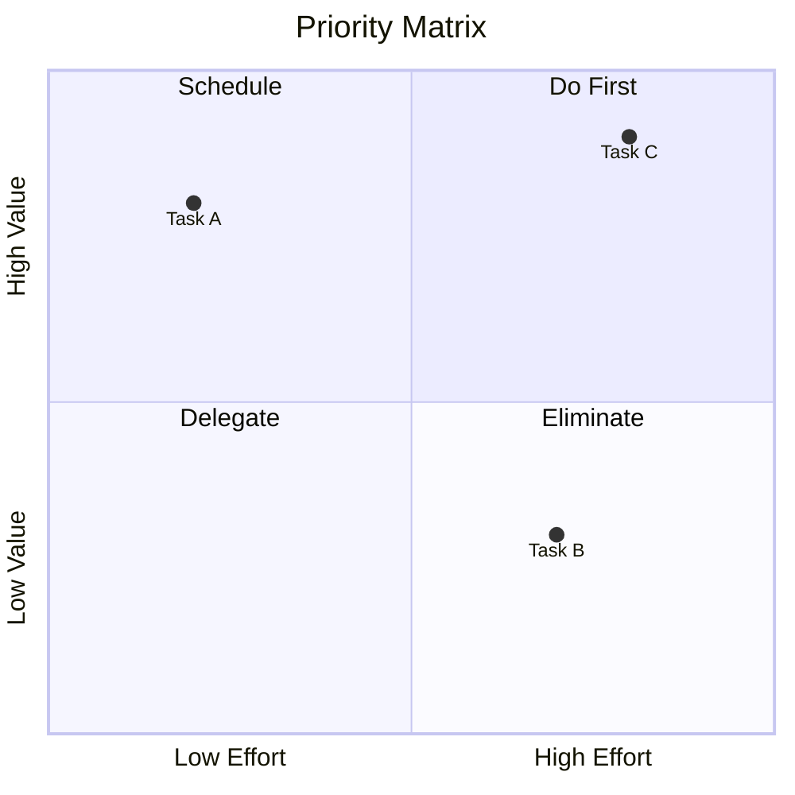

Data points use `[x, y]` coordinates (0.0 to 1.0). Supports `classDef` for point styling and inline `radius:`, `color:`
on individual points.

## XY Chart

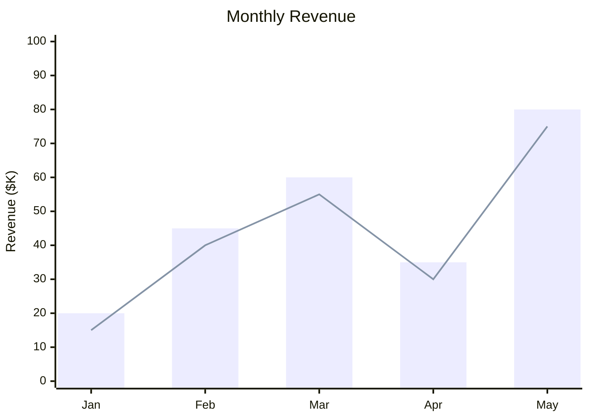

Supports both `bar` and `line` series on the same chart. Use `xychart-beta horizontal` for horizontal orientation.

## Sankey Diagram

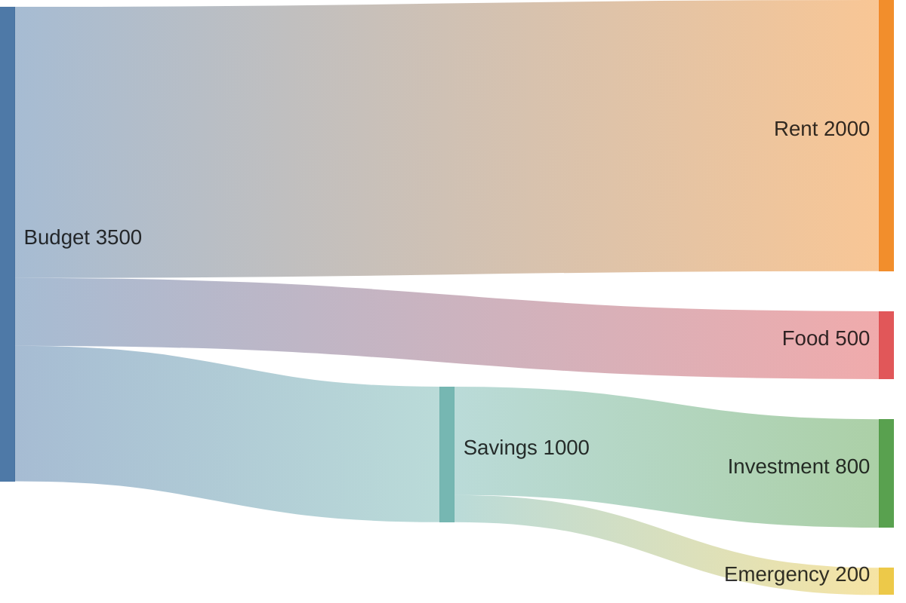

CSV-like format: `Source,Target,Value`. No spaces around commas. Layout is automatic based on flow data.

## Block Diagram

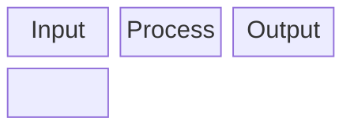

### Key Concepts

- `columns N` — defines layout grid width
- `A:N` — block spans N columns
- `space` or `space:N` — empty spacer blocks
- Nested groups: `block:groupName columns N ... end`
- Arrow blocks: `arr<["Label"]>(down)` — visual flow indicators
- Shapes use flowchart node syntax (`[]`, `()`, `{}`, etc.)

Block diagrams give the author **full control over positioning** via the grid system, unlike flowcharts which rely on
auto-layout.

## Architecture Diagram

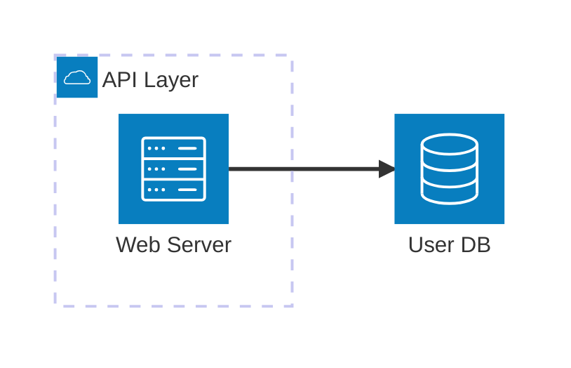

### Elements

- `service <id>(<icon>)["Label"]` — a service node
- `group <id>(<icon>)["Label"]` — a group container
- `junction <id>` — a connection point

### Built-in Icons

`cloud`, `database`, `disk`, `internet`, `server`. Custom icons require Iconify registration at the integration level.

### Connections

`element1:SIDE --> SIDE:element2` where SIDE is `L`, `R`, `T`, `B`. Arrow types: `--` (line), `-->` (arrow), `<--`
(reverse), `<-->` (bidirectional).

## Packet Diagram

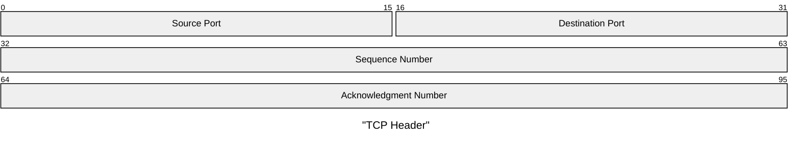

Each row represents 32 bits. Fields defined by bit ranges (0-indexed). No gaps or overlaps allowed.

## Kanban Board

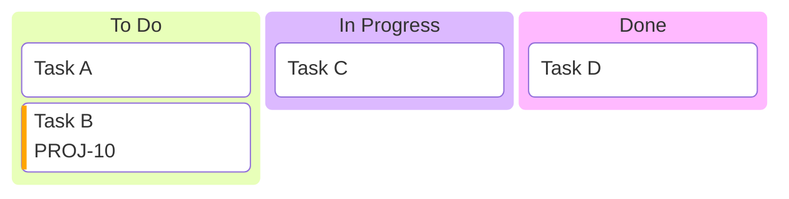

Unindented lines = columns. Indented lines = tasks. Metadata via `@{key: 'value'}`.

## Requirement Diagram

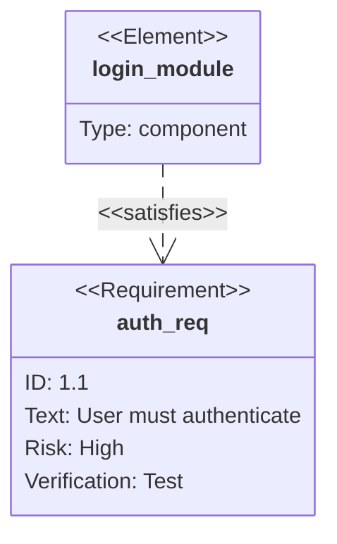

### Requirement Types

`requirement`, `functionalRequirement`, `interfaceRequirement`, `performanceRequirement`, `physicalRequirement`,
`designConstraint`

### Relationship Types

`satisfies`, `contains`, `copies`, `derives`, `verifies`, `refines`, `traces`

## C4 Diagrams

```mermaid
C4Context
    title System Context
    Person(user, "Customer", "Uses the banking app")
    System(app, "Banking System", "Stores accounts and transactions")
    System_Ext(email, "Email System", "Sends notifications")
    Rel(user, app, "Uses", "HTTPS")
    Rel(app, email, "Sends emails", "SMTP")
```

### Diagram Levels

- `C4Context` — system context
- `C4Container` — container level
- `C4Component` — component level
- `C4Dynamic` — dynamic interactions

### Elements

- `Person(alias, "Label", "Description")`
- `System(alias, "Label", "Description")` / `System_Ext(...)` for external
- `Container(alias, "Label", "Technology", "Description")` / `ContainerDb(...)` / `ContainerQueue(...)`
- `Component(alias, "Label", "Technology", "Description")`

### Boundaries

`System_Boundary(alias, "Label") { ... }` or `Container_Boundary(alias, "Label") { ... }`

### Relationships

`Rel(from, to, "Label", "Technology")` — directional variants: `Rel_R`, `Rel_L`, `Rel_U`, `Rel_D`

### Layout

`LAYOUT_TOP_DOWN()`, `LAYOUT_LEFT_RIGHT()`, `LAYOUT_WITH_LEGEND()`

## User Journey

```mermaid
journey
    title User Onboarding
    section Registration
        Visit signup page: 5: User
        Fill in form: 3: User
        Verify email: 2: User
    section First Use
        Complete tutorial: 4: User
        Create first project: 5: User
```

Tasks use `Task description: score: Actor1, Actor2`. Score is 0-5 (higher = better experience).

## Theming

### Built-in Themes

```mermaid
%%{init: {'theme': 'neutral'}}%%
flowchart TD
    A --> B
```

Available themes: `default`, `neutral`, `dark`, `forest`, `base`

- `neutral` — best for professional documentation and print
- `dark` — for dark-mode contexts
- `forest` — green shades
- `base` — the only modifiable theme; use as foundation for `themeVariables`

### Custom Styling with themeVariables

Only the `base` theme supports `themeVariables`. Only hex colors work — not color names.

```mermaid
%%{init: {
  'theme': 'base',
  'themeVariables': {
    'primaryColor': '#a5d8ff',
    'primaryBorderColor': '#1971c2',
    'lineColor': '#868e96',
    'textColor': '#1e1e1e',
    'fontSize': '16px'
  }
}}%%
```

### Core Theme Variables

- `primaryColor` — node background; other colors derive from this
- `primaryTextColor` — text inside nodes
- `primaryBorderColor` — node borders
- `secondaryColor` / `tertiaryColor` — secondary/tertiary elements, subgraph backgrounds
- `lineColor` — edges and connections
- `textColor` — general text (labels, titles)
- `mainBkg` — background for flowchart objects, class diagram classes
- `fontFamily` — font (default: trebuchet ms, verdana, arial)
- `fontSize` — text size (default: 16px)
- `noteBkgColor` / `noteTextColor` / `noteBorderColor` — note styling

### Diagram-Specific Variables

- **Flowchart:** `nodeBorder`, `clusterBkg`, `clusterBorder`, `defaultLinkColor`, `edgeLabelBackground`, `nodeTextColor`
- **Sequence:** `actorBkg`, `actorBorder`, `actorTextColor`, `signalColor`, `labelBoxBkgColor`, `activationBkgColor`,
  `sequenceNumberColor`
- **Gantt:** `sectionBkgColor`, `sectionBkgColor2`, `altSectionBkgColor`
- **Pie:** `pie1` through `pie12` (slice colors), `pieTitleTextSize`, `pieStrokeColor`
- **State:** `labelColor`, `altBackground`
- **Journey:** `fillType0` through `fillType7`

### Per-Node Styling (classDef)

```mermaid
flowchart TD
    A[Start]:::highlight --> B[Process]
    classDef highlight fill:#a5d8ff,stroke:#1971c2,stroke-width:2px
    classDef error fill:#ffc9c9,stroke:#e03131
```

`classDef` is supported in: flowcharts, state diagrams, block diagrams, quadrant charts. In class diagrams, prefer CSS
classes over `classDef`.

`classDef default fill:#...` styles all nodes unless overridden.

## Platform Compatibility

Mermaid rendering varies across platforms. Key differences:

<platform-compatibility>

**Syntax:** GitHub, GitLab, Obsidian, and VS Code use standard ` ```mermaid ` fenced blocks. Azure DevOps uses
non-standard `:::mermaid` syntax.

**Click events and interactivity:** Disabled on GitHub and most hosted platforms (default `securityLevel: strict`). Only
works when `securityLevel` is set to `loose` — rarely available on public platforms. Do not generate click events for
markdown-embedded diagrams.

**FontAwesome icons:** Require site-level integration of FA v4/v5. Will silently disappear on platforms without the font
loaded (GitHub, most static sites). Do not rely on icons for essential information.

**Version lag:** Obsidian's built-in renderer lags significantly (~v11.4). GitHub lags moderately. VS Code extensions
track the latest release. Beta diagram types (`xychart-beta`, `sankey-beta`, `block-beta`, `packet-beta`,
`architecture-beta`) may not render on older integrations.

**Dark/light mode:** GitHub may render diagrams with different text colors in dark vs. light mode, causing readability
issues. Using `%%{init: {'theme': 'neutral'}}%%` provides the most consistent cross-mode experience. Avoid custom colors
that assume a specific background.

**Tooltips:** Unreliable across platforms — documented as having upstream bugs even on the official Mermaid site.

</platform-compatibility>

## Best Practices

- Keep node labels short (3-5 words max) — long labels break auto-layout
- Use subgraphs to create visual grouping
- For sequence diagrams, use participant aliases (`participant U as User`) to keep messages compact
- Use `%%{init: {'theme': 'neutral'}}%%` for professional, portable diagrams
- Maximum ~15 nodes in a flowchart before readability degrades
- Use `direction` to match conceptual flow (LR for processes, TD for hierarchies)
- For complex diagrams, split into multiple Mermaid blocks with prose connecting them
- Quote all labels containing special characters: parentheses, brackets, colons, commas
- Never use lowercase `end` as a node ID — capitalize or quote it
- Avoid click events and tooltips in documentation diagrams — they fail on most platforms
- Prefer `neutral` theme for cross-platform consistency
- Use `classDef` for visual emphasis rather than inline `style` statements
- For architecture-level views, consider C4 diagrams over complex flowcharts
- For data flow visualization, prefer Sankey over flowcharts with many crossing edges
